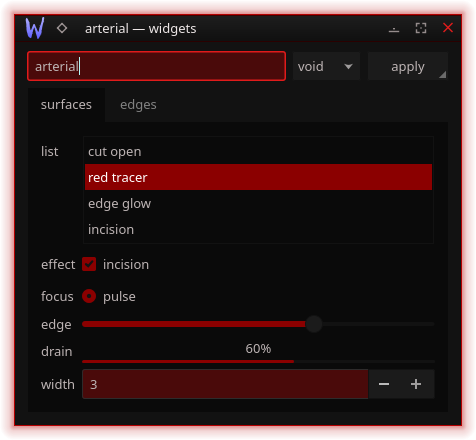
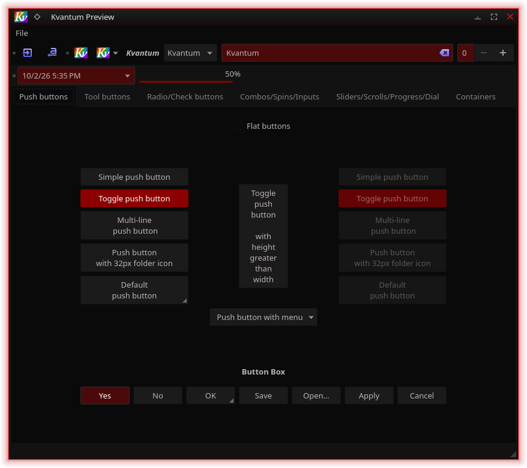
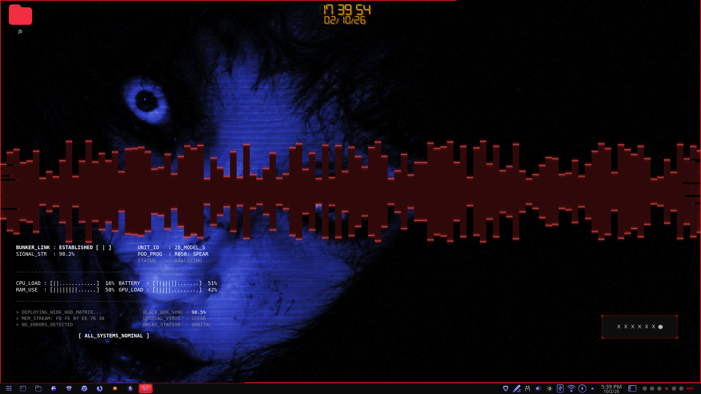

# Arterial

A coordinated **black / dark-grey / arterial-red** desktop suite for KDE Plasma 6,
by **splicer scorn** (voidrane). Near-black content, dark-grey chrome, thin red edges,
and two custom KWin shader effects.

One Python generator (`build.py`) holds the palette and writes every asset, so the pieces
can't drift apart. Each folder under [`kde-store/`](kde-store/) is a self-contained,
ready-to-upload package with its own README and preview.

## Components

| Part | Folder | KDE Store category |
| --- | --- | --- |
| Color scheme | [`kde-store/color-scheme`](kde-store/color-scheme) | Color Schemes |
| Window decoration (Aurorae) | [`kde-store/aurorae`](kde-store/aurorae) | Window Decorations |
| Plasma style | [`kde-store/plasma-style`](kde-store/plasma-style) | Plasma Styles |
| Kvantum theme | [`kde-store/kvantum`](kde-store/kvantum) | Kvantum Themes |
| KWin effects (incision + pulse) | [`kde-store/kwin-effects`](kde-store/kwin-effects) | KWin Effects |
| Konsole scheme | [`kde-store/konsole`](kde-store/konsole) | — |
| kitty + mako | [`kde-store/terminal-extras`](kde-store/terminal-extras) | — |

## Gallery

| | |
| --- | --- |
|  |  |
| active vs inactive window edge | Qt widgets (Kvantum) |
|  |  |
| `arterial_incision` mid-animation | Konsole palette |
|  | |
| `arterial_pulse` focus flash | |

## Install everything

    git clone https://github.com/numbpill3d/arterial-kde
    cd arterial-kde
    ./install.sh      # copies into ~/.local/share + ~/.config and applies live
    ./revert.sh       # restores the configs saved before the first install

`install.sh` backs up your current config to `~/.local/share/arterial-backup/<timestamp>/`
first. To change the look, edit the palette at the top of `build.py`, then
`python3 build.py && ./install.sh`. Re-pack the upload folders with `./package.sh`.

### Ready-to-upload archives

`./make-store-archives.sh` writes a `.tar.gz` per part (theme files only) plus its
screenshots and a category note into `~/Documents/Arterial KDE Store/` — attach each
archive to the matching category at https://store.kde.org.

## What it changes

- Widget style → Kvantum (running Qt apps need a restart)
- Window decoration border size → Normal (so side edges render)
- Disables the "Doom" open/close effect (its slot is taken by `arterial_incision`)
- Adds a `~/.config/mako/config` and a kitty `include` line
- Sets the Arterial color scheme on your default Konsole profile

GTK apps, Firefox/Floorp client-side title bars, and kitty's hidden decorations don't pick
up the red window edge — see the notes in each component README.

## Credits & license

GPL-3.0-or-later. The Kvantum map descends from **KvArcDark** (Tsu Jan). The KWin effects
build on the **Burn-My-Windows** shader harness (Simon Schneegans, Vlad Zahorodnii,
Martin Flöser). Both are GPL-3.0-or-later; notices are kept alongside the derived files.
