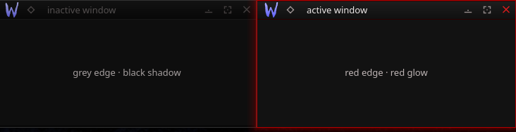

# Arterial — Aurorae Window Decoration

A minimal Aurorae decoration. The active window carries a 1px red edge with a soft red
outer glow; inactive windows fall back to a grey edge and a black shadow. Title-bar
buttons are reticle-style glyphs; the close button runs hot. Maximized windows keep the
red top line.

## Install

    mkdir -p ~/.local/share/aurorae/themes
    cp -r Arterial ~/.local/share/aurorae/themes/

Then System Settings → Window Decorations → **Arterial**, or:

    kwriteconfig6 --file kwinrc --group org.kde.kdecoration2 --key theme __aurorae__svg__Arterial
    kwriteconfig6 --file kwinrc --group org.kde.kdecoration2 --key BorderSize Normal
    qdbus6 org.kde.KWin /KWin reconfigure

> Border size must be at least `Normal`, or the thin side edges don't render.

## KDE Store

Category: **Plasma 6 › Window Decorations (Aurorae)**. Zip the `Arterial/` folder and
upload with `preview.png`.

By splicer scorn (voidrane). GPL-3.0-or-later.
