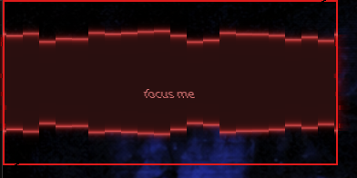

# Arterial — KWin Effects

Two scripted KWin shader effects built on the Burn-My-Windows harness
(by Simon Schneegans, Vlad Zahorodnii, Martin Flöser; GPL-3.0-or-later).

_`arterial_incision` — window cut open along a ragged red incision_

_`arterial_pulse` — focused window edge flashes red_

- **arterial_incision** (open/close): red tracers run the window outline, then the window
  is cut open along a ragged horizontal incision. Close plays it in reverse.
- **arterial_pulse** (focus): the newly focused window's edge flashes red and fades.

## Install

    mkdir -p ~/.local/share/kwin/effects
    cp -r arterial_incision arterial_pulse ~/.local/share/kwin/effects/
    kwriteconfig6 --file kwinrc --group Plugins --key arterial_incisionEnabled true
    kwriteconfig6 --file kwinrc --group Plugins --key arterial_pulseEnabled true
    qdbus6 org.kde.KWin /KWin reconfigure

Enable them in System Settings → Desktop Effects (where duration/colour are adjustable).

> `arterial_incision` uses the exclusive window open/close slot, so another effect in that
> slot (e.g. the "Doom" effect) must be disabled. Built for a low-power Intel GPU: the
> effects are transient (open/close/focus only), not a per-frame shader on every window.

## KDE Store

Category: **Plasma 6 › KWin Effects**. Zip each effect folder (`arterial_incision/`,
`arterial_pulse/`) and upload separately, or together with a preview.

By splicer scorn (voidrane). GPL-3.0-or-later.
