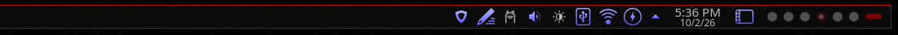

# Arterial — Plasma Style

The desktop theme: panel, popups, dialogs, widgets and tooltips as flat near-black
surfaces with a 1px red edge and bright red corner brackets.

## Install

    mkdir -p ~/.local/share/plasma/desktoptheme
    cp -r Arterial ~/.local/share/plasma/desktoptheme/
    plasma-apply-desktoptheme Arterial

If a rebuilt theme doesn't refresh live, clear the cache and restart the shell:

    rm -rf ~/.cache/plasma-svgelements* ~/.cache/plasma_theme_Arterial*
    systemctl --user restart plasma-plasmashell

## KDE Store

Category: **Plasma 6 › Plasma Styles**. Zip the `Arterial/` folder, upload with a preview.

By splicer scorn (voidrane). GPL-3.0-or-later.
