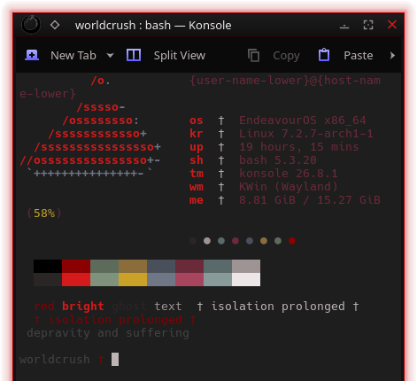

# Arterial — Terminal Extras (kitty + mako)

Matching palettes for things outside Plasma's theming.

## kitty

    mkdir -p ~/.config/kitty
    cp kitty/arterial.conf ~/.config/kitty/
    printf '\ninclude arterial.conf\n' >> ~/.config/kitty/kitty.conf

## mako (Wayland notifications)

    mkdir -p ~/.config/mako
    cp mako/config ~/.config/mako/config
    makoctl reload

By splicer scorn (voidrane). GPL-3.0-or-later.
